 # 🐳 Docker + MongoDB + Flask Setup Guide

This guide explains how to prepare, install, and test a Flask application connected to MongoDB using Docker.

---

## Preparation
### Prerequisites:
  - A basic understanding of Docker and Kubernetes
  - Docker installed on the computer
  - Minikube and Kubectl installed on computer
  - An AWS account
  - DockerHub Account

### 1. Download the Source Code
For this assignment, create a simple TO-DO web application uisnbg Flask and MongoDB.
Download the project source code from the provided Google Drive folder.

---

### 2. Install Docker (macOS)
Follow [Docker Desktop installation for Mac](https://docs.docker.com/desktop/setup/install/mac-install/).

Alternatively, using command line:

```bash
sudo hdiutil attach Docker.dmg
sudo /Volumes/Docker/Docker.app/Contents/MacOS/install
sudo hdiutil detach /Volumes/Docker
```

Check Docker version:

```bash
docker --version
```

---

### 3. Install Kubernetes Tools (Optional)

Install **kubectl** and **minikube** using Homebrew:

```bash
brew install kubectl
brew install minikube
```

Verify installations:

```bash
kubectl --help
minikube --help
```

---

## Test on Local Machine (MacOS)

### 1. Set Up the Environment
Unzip the downloaded file, navigate into the project folder, and install dependencies:

```bash
pip install -r requirements.txt
```

---

### 2. Run MongoDB Using Docker
To run the MongoDB we can get the image, and use it.
Pull the official MongoDB image:

```bash
docker pull mongo
```
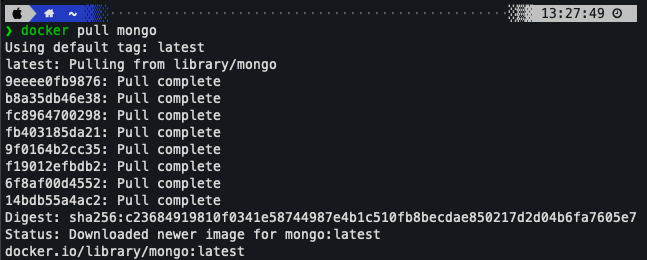
Run the MongoDB container:

```bash
docker run -d   --name mongodb   -p 27017:27017   -v mongo_data:/data/db   mongo
```

**Explanation:**
- `-d` → Run in detached mode (background)
- `--name mongodb` → Container name
- `-p 27017:27017` → Expose MongoDB default port
- `-v mongo_data:/data/db` → Persist data using Docker volume
- `mongo` → Use the official MongoDB image

Check if the container is running:

```bash
docker ps
```
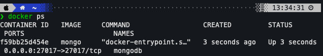
From thie image, we can see the our MongoDB is up, and expose to the 27017 prot.

---

### 3. MongoDB Configuration in `app.py`

The Flask app connects to MongoDB as follows:

```python
mongodb_host = os.environ.get('MONGO_HOST', 'localhost')
mongodb_port = int(os.environ.get('MONGO_PORT', '27017'))
client = MongoClient(mongodb_host, mongodb_port)
db = client.camp2016
todos = db.todo
```

---

### 4. Start the Flask Application

Run the Flask app:

```bash
python3 app.py
```

Then open your browser and go to:

[http://127.0.0.1:5000](http://127.0.0.1:5000)

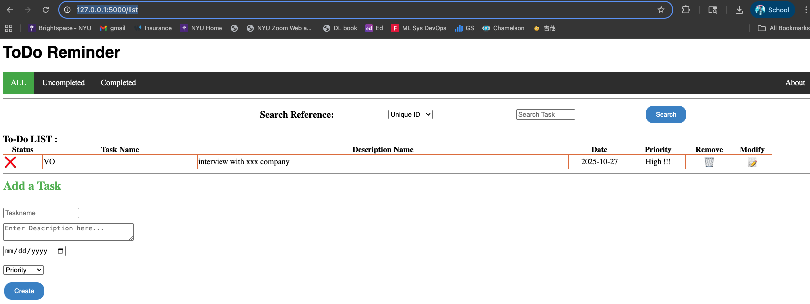
to verify the application is running locally.

---

## Inspect Docker Volumes
To ensure that if we hook our flask application to the MongoDB right.
We can add some some to-do to the list, and check the database.
To check your MongoDB volume localy:

```bash
docker volume inspect mongo_data
docker volume ls
```
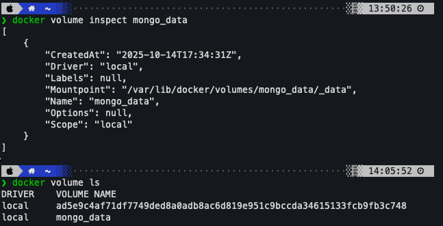
It lists all the docker volumes on the system.
By look at the screenshot, we have two local volume on the system
Also we can check the detail of the mongo_data, which give the information about created time, diver, mountpoint, name, and scope.
---

## Inspect MongoDB Data

Access MongoDB shell inside the container:

```bash
docker exec -it mongodb mongosh
```

Then run:

```bash
use camp2016                # switch to database
show collections            # list collections
db.todo.find().pretty()     # view data inside 'todo' collection
```
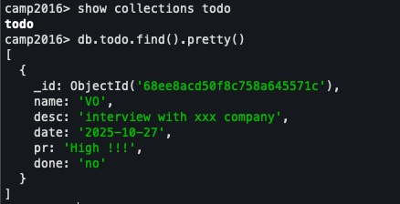
As we created a to-do list, we can go inside and check.
It correct provide the data we have input to the list.
Name: VO
Desc: interview with xxx company
Date: 2025-10-27
Pr: High
Done: no

---

**Successfully set up Docker, MongoDB, and Flask locally!**


## Containize 
Install Docker on local machine by lowanloading and installing it from the [Docker](https://www.docker.com/products/docker-desktop/)
Use two containers for the applications, one for the flask app and one for persisting the data in MongoDB.
### 1.Create a Dockfile for Flask App
Write a Dockerfile for the flaks application, which will contain instructions to build the Docker image. The Dockerfile will set the working directory, copy the application code into the container, and specify the command to run the application.

```
# Use the official Python 3.8 slim image as the base image
FROM python:3.8-slim

# Set the working directory within the container
WORKDIR /app

COPY requirements.txt .

# Upgrade pip and install Python dependencies
RUN pip3 install --upgrade pip && pip install --no-cache-dir -r requirements.txt

# Copy the rest of app
COPY . .

# Expose Flask port default
EXPOSE 5000

CMD ["python", "app.py"]
```

### 2.build the image
Build the Docker images using the Docker CLI.
This will use the instrucftions in the Dockerfile to build the Docker images.
```
# docker build -t flask-app .
docker buildx build -t flask-app .
```
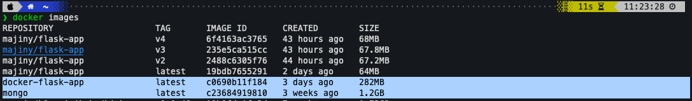
### 3. build the conatiner
```
docker run -d -p 5000:5000 flask-app flask-app
```

### bug
 -  MacOS using port 5000 for airplay, need to shut down it to use 5000 port
 - pymongo.errors.ServerSelectionTimeoutError: localhost:27017: [Errno 111] Connection refused
    - inside the flask container, localhost means the Flask containner itself, not the host or Mongo cantainer.
    ```
    client = MongoClient('localhost', 27017)
    ```

### fix it
To test the application locally, write a docker-compse file that defines the services for the flask app adn MongoDB container. The docker-compose file should specify the images to use, the ports to expose, and to mount to store the database information.
    - using docker-compose.yaml
    - for localtest manual docker run with --network
    also add the host address
    ```
    host = os.environ.get('FLASK_RUN_HOST', '0.0.0.0')
    ```
```
#create a bridge network name flasknet, so conatiners on the same network can communicate by name
docker network create flasknet
docker run -d --name mongodb --network flasknet -p 27017:27017 mongo
docker run -d --name flask-app --network flasknet -p 5000:5000 flasknet -e MONGO_HOST=mongodb flask-app
```
### 4. push to Docker Hub
Push the Docker image to [DockerHub](https://hub.docker.com/) to make it available for deployment to Kubernetes. This will require creating a DockerHub account and using the Docker CLI to push the image to the DockerHub registry.
```
docker push majiny/flask-app:latest
```
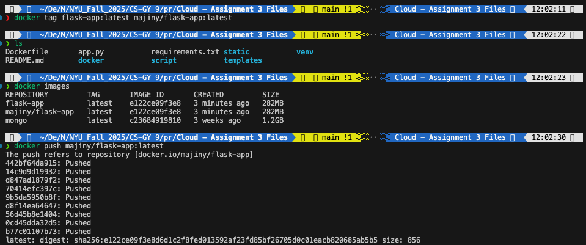

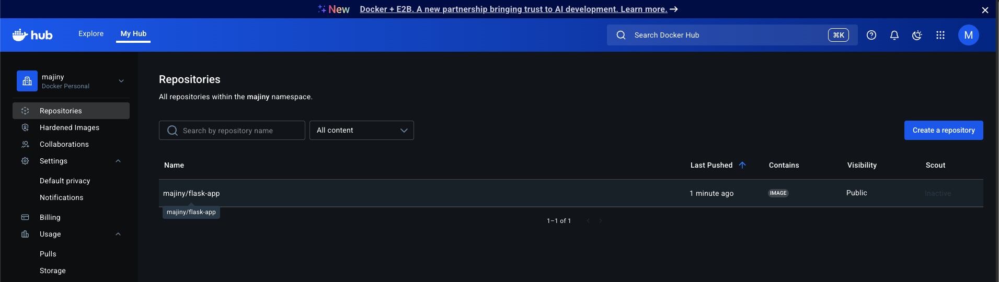

## Deploy to the minikube
Since we have minikube downloaded before, so that we can create the deploy to the minikube.

### 1. Start minikube
Start Minikube on local machine using the command-line interface.
```
minikube start
```
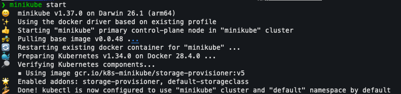


### 2. create the yaml file
    1. mongodb-pvc.yaml - Persistent Storage for MongoDB:
        - persistentVolumeClaim(PVC)-> A request for storage space in Kubernetes.
        - accessModes: ReadWriteOnce-> The volumen can be mounted as read-write by only one node.
        - resources.requests.storage-> Requests 256 MB of space.,
    MongoDB stores its database files under /data/db. 
    Without a PVC, that data disappears when the container restarts. 
    This ensures data persistence, the database survives redeployments.

    2. mongodb-deployment.yaml - Running MongoDB Pod:
        - kind: Deployment-> Ensures a specific # of identical pods run continuously.
        - metadata.name-> Deployment name (mongodb-deployment).
        - selector/labels-> Used to connect pods, services, and deployments.
        - containers-> Defines which image to run (we used mongo:latest).
        - containerPort-> MongoDB listens on port 27017 (defauly port for MongoDB).
        - aresources.requests-> Reserves 256 MB memory and 0.5 CPU for Mongo.
        - volumeMounts-> Mounts the PVC inside the container at /data/db.
        - volumes-> Attaches the PVC created earlier (mongodb-pvc)
    MongoDB Deployment spins up MongoDB and mounts a persistent volume for storage. 
    Even if the Mongo pod is deleted and recreated, the data remains.
    3. mongodb-service.yaml - Internal Service for MongoDB:
        - kind: Service-> exposes a stable endpoint (DNS name) for Mongo pods.
        - selector.app: mongo-> Connects this Service to pods with label app: mongo.
        - port/ targetPort-> Routes traffic from Service port 27017-> pod port 27017.
    Flask can not directly know a pod's IP (pods are dynamic). 
    Instead, it connects to mongo-service: 27017, a stable hostname managed by Kubernetes DNS.
    4. flask-deployment.yaml - Flask App Deployment:
        - replicas: 1 -> Run on Flask pod (for Minikube demon).
        - images: majiny/flask-app-> The flask app we pushed to Docker Hub before.
        - containerPort: 5000 -> Flask runs internally on port 5000.
        - en variables -> Tell Flask where to find MongoDB.
            - MONGO_HOST=mongo-service
            - MONGO_PORT=27017
        - imagePullyPolicy: IfNotPresent->Uses a cached local image if available
    This defines the applicaiton container. 
    It runs Flask, connects to MongoDB vai service name, and exposes port 5000 inside the cluster.
    5. flask-service.yaml - Exposing Flask to the Outside World:
        - type: LoadBalancer -> Create an external access point/ outside cluster.
        - port: 5000 -> Port exposed to the world.
        - targetPort: 5000 -> Port inside the pod where Flaks runs.
        - selector.app: to-do _> Link to Flaks pod labeld app: to-do
    This lets users access ahte Flask app from outside Kubernetes.

### 3. deploy service
Create two pods: one for flask app and one for MongoDB to store data.
Creata a Kubernetes deployment for the application by specifying the Docker image from DockerHub, the number of replicas, and teh container port.
Expose the deployment using Kubernetes service to make the application accessible from outside the cluster. The service should expose the container portand provide load balancing to distribute traffic to the replicas.
using the code to deploy the service.
```
kubectl apply -f mongodb-pvc.yaml
kubectl apply -f mongodb-service.yaml
kubectl apply -f mongodb-deployment.yaml
kubectl apply -f flask-deployment.yaml
kubectl apply -f flask-service.yaml
```
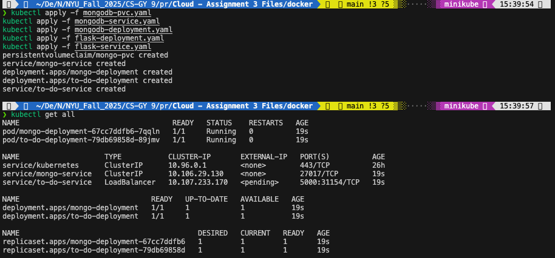

We notice that the external-ip for to-do-service is in pending state, since Minikube runs locally, not in the cloud.
Type LoadBalancer requires a cloud provider, in cloud environment, K8s talks to the cloud load balancer API, the cloud provider allocates an external IP. Then the service status updates with that external IP the cloud provider provide.

### 4. Test the app in Minikube 
Test the application to ensure that it is running on Minikube by accessing it using the service URL.
```
# getting service URL
minikube service to-do-service
```
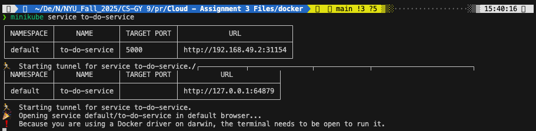

and we can see the URL address is http://127.0.0.1:64879 and we can visited the site by using this URL.
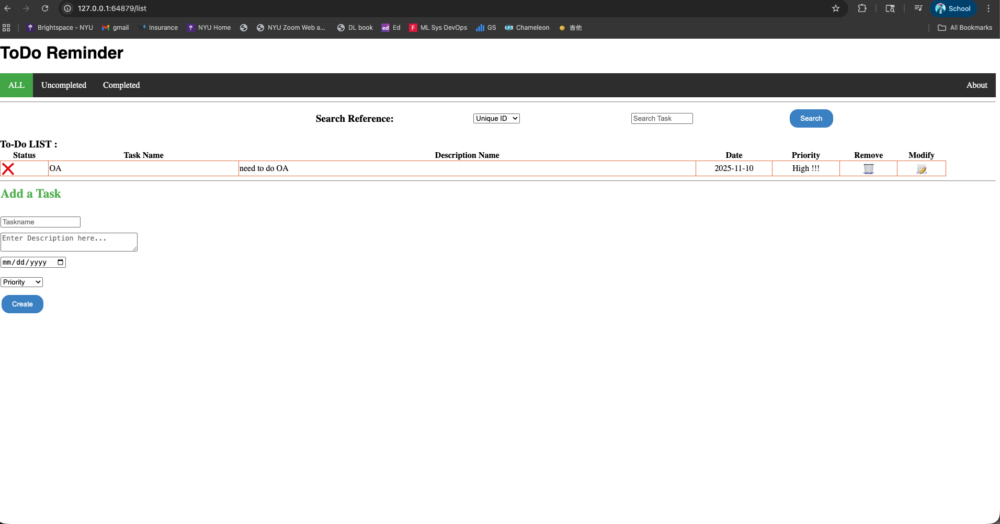

we can see that Flask app runs on the Minikube has different IP address than it runs on the local machine.

## Deploy to AWS EKS
Create an AWS EKS cluster using the AWS Management Console or the AWS CLI. This will provide the Kubernetes infrastructure for running the application.
There are three ways to set up the EKS setup:
  - [EKS Auto Mode](https://docs.aws.amazon.com/eks/latest/userguide/getting-started-automode.html)
  - [eksctl](https://docs.aws.amazon.com/eks/latest/userguide/getting-started-eksctl.html)
  - [Console and CLI](https://docs.aws.amazon.com/eks/latest/userguide/getting-started-console.html)

I used the eksctl, since eksctl helps to handle:
- Creates a VPC with subnets in multiple AZs
- Sets up security groups & routing
- Creates IAM roles for cluster & nodegroups (nodegroups set up for awsclt and UI is tough)
- Connects worker nodes to the contorl plane
- Updates kubeconfig file so kubectl works inmmediately
- SupporTs Fragate profiles, managed node groups, addones. 
### 1. download AWS CLI and EKS CLT
To download AWS CLI
```
curl "https://awscli.amazonaws.com/AWSCLIV2.pkg" -o "AWSCLIV2.pkg"
sudo installer -pkg AWSCLIV2.pkg -target /

$ which aws
/usr/local/bin/aws 
$ aws --version
aws-cli/2.31.9 Python/3.13.7 Darwin/25.1.0 source/arm64
```

To download EKS CLI
```
brew install eksctl
```

### 2. Create cluster
the easy we to create the cluster, we can use
[eksctl][https://docs.aws.amazon.com/eks/latest/userguide/getting-started-eksctl.html]
```
eksctl create cluster \
  --name flask-mongo-cluster \
  --region us-east-1 \
  --nodes 1 \
  --node-type t3.micro
```

After launch, we can see
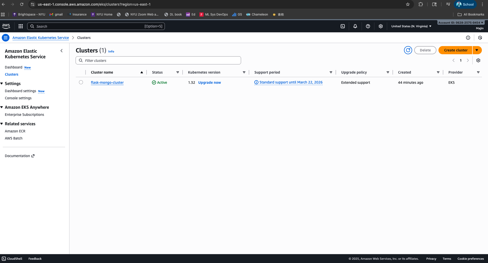

Since there we limited cpu as 500m and memory: 256Mi.
When we trying to deploy the app, there in no engough resource,
So the deployment won't be success.
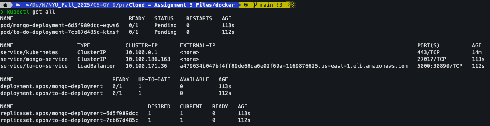


Using the kubectl to check why it is pending
```
kubectl describe pod <POD_ID>
```
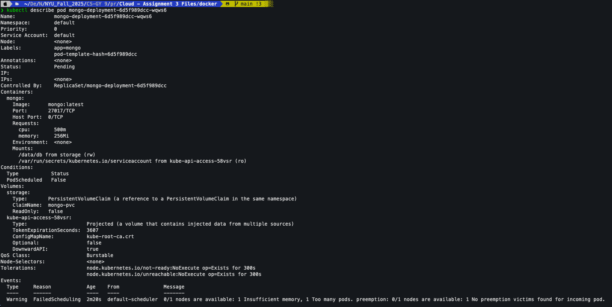


Delete the resource we had before and rebuild
```
eksctl delete cluster --name flask-mongo-cluster --region us-east-1


eksctl create cluster \
  --name flask-mongo-cluster \
  --region us-east-1 \
  --nodegroup-name flask-nodegroup \
  --nodes 2 \
  --nodes-min 1 \
  --nodes-max 3 \
  --managed \
  --node-type t3.small
```


### 3. set up addon
By default, Kubernetes iteself doesn't know how to talk to AWS EBS volumes - it needs a "driver" that acts as a translator between Kubernetes and AWS's storage APIs.
EBS CSI(conatiner storage interface) Driver
-  Dynamically provision EBS volumes when create PersistentVolumeClaims.
- Attach/detach them automatically to pods.
- Delete them safely when no longer needed.

Since we want to use pvc storage
we need to Enable OIDC provbider (required for IAM-> K8s mapping)
```
eksctl utils associate-iam-oidc-provider \
  --region us-east-1 \
  --cluster flask-mongo-cluster \
  --approve
```
EKS uses IAM Roles for Services Account(IRSA) to let pods securely call AWS APIs.
For that to work, the EKS cluster must have an OIDC (OpenID Connect) identity provider associated with it.
  - The EBS CSI driver pod can assume an IAM role.
  - AWS can verify that this pod is authorized to call EBS APIs.
without this, the driver pod won't have permission to manage EBS volumes.

then create IAM role for the EBS CSI driver
```
eksctl create iamserviceaccount \
  --region us-east-1 \
  --name ebs-csi-controller-sa \
  --namespace kube-system \
  --cluster flask-mongo-cluster \
  --attach-policy-arn arn:aws:iam::aws:policy/service-role/AmazonEBSCSIDriverPolicy \
  --approve \
  --role-name AmazonEKS_EBS_CSI_DriverRole
```
This command:
  - Creates a Kubernetes ServiceAccount (ebs-csi-controller-sa)
  - Creatae an IAM Role
  - Attach the AWS managed policy AmazonEBSCSIDriverPolicy
  - Links the Service Account with the IAM Role via OIDC.
This gives the EBS CSI pod power to create/delete/attach/detach EBS volumes. 

Install the AWS EBS CSI driver add-on
```
aws eks create-addon \
  --region us-east-1 \
  --cluster-name flask-mongo-cluster \
  --addon-name aws-ebs-csi-driver \
  --service-account-role-arn arn:aws:iam::<id>:role/AmazonEKS_EBS_CSI_DriverRole  #use  the id we set up before 
```
This command installs the AWS-managed EBS CSI driver add-on into the cluster
It tells EKS, deploy the official EBS CSI driver into the kube-system namespace.
Let it use the IAM role that created, so it can talk to AWS APIs.

To verify installation
```
kubectl get pods -n kube-system | grep ebs
```
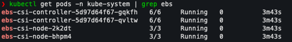
Now the driver is successfully deployed  and ready to handle PVCs. 

### 4. deploy to eks
Create a Kubernetes deployment for the application in the EKS cluster. This deployment will specify the Docker image to use, the number that the application listens on.
To get pvc running we run same code we had as we deploy to the Minikube
```
kubectl apply -f mongodb-pvc.yaml 
kubectl get pvc
```
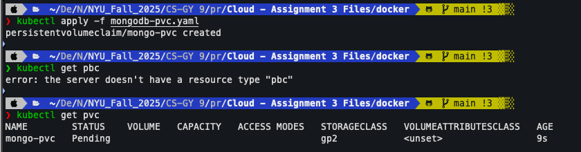
we will see there is still no VOLUME, CAPACITY, ACCESS, and MODES
by checking pvc mongo-pvc 
```
kubectl describe pvc mongo-pvc
```
we see the message waiting for first Consumer to be created before binding
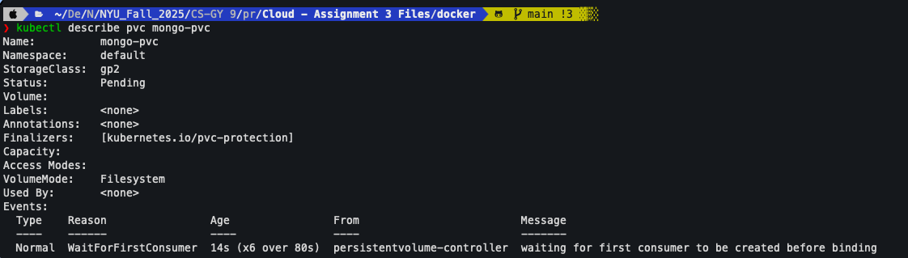

After we apply mongo-deployment
```
kubectl apply -f mongodbv-deployment.yaml
kubectl get pods
kubectl get pvc
```
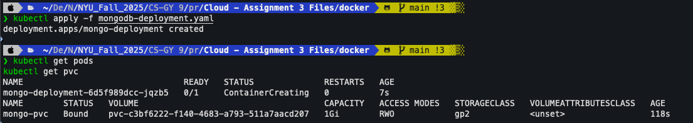

Then we apply reset of yaml file
Expose the deployment using a Kubernetes service. This service will provide load balancing for the application and expose the container port so that it can be accessed from outside the EKS cluster.
```
kubectl apply -f mongodb-service.yaml
kubectl apply -f flask-deployment.yaml
kubectl apply -f flask-service.yaml
kubectl get all
```
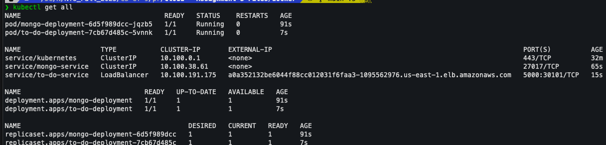

The all nodes are running, and we have a external-ip for our to-do-service
but we can not visited yet, it takes time to set up
！[waiting_external_ip](./screenshot/external_ip.png)

Test the application to ensure that it is running on AWS EKS. This will verify that the deployment and service were configured correctly and that the application is accessible from outside the EKS cluster.

now we can use [http://a0a352132be6044f88cc012031f6faa3-1095562976.us-east-1.elb.amazonaws.com:5000/](http://a0a352132be6044f88cc012031f6faa3-1095562976.us-east-1.elb.amazonaws.com:5000/) to visited our application
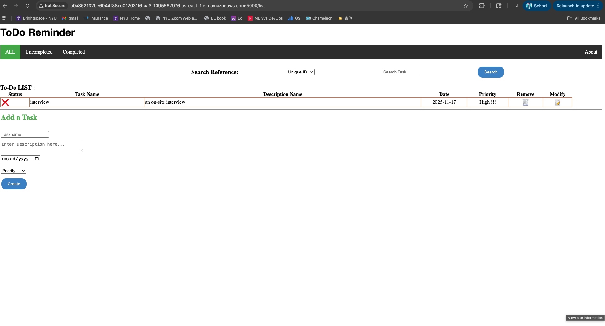


## Deployments and ReplicaSets
Before we change the replicas1
we have defined replicas as 1
Define the desired number of replicas in the flask-deployment.yaml file under spec.replicas.
```
spec:
  replicas: 1
```
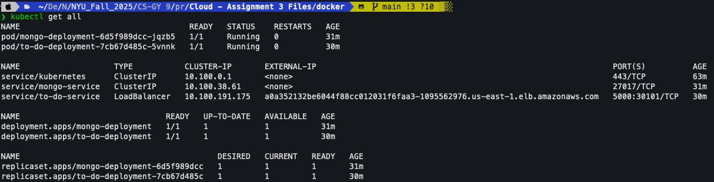

after we change it to 5
```
spec:
  replicas: 5
```
Apply the deployment using 'kubectl apply -f flask-deployment.yaml'.
Verify teh ReplicaSet with 'kubectl get rs'.
```
kubectl apply -f flask-deployment.yaml
# Verify the ReplicasSet
kubectl get all
kubectl get rs
```
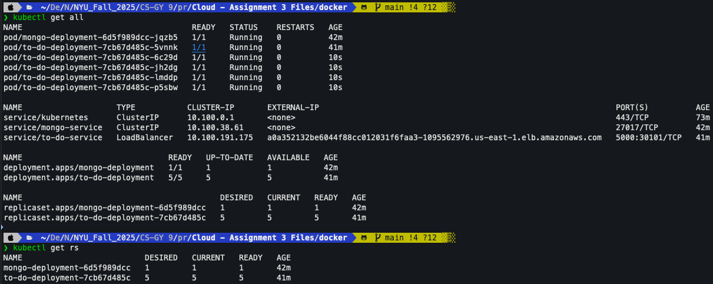

Delete one pod and observe Kubernetes automatically creating a replacement pod.
When we delete the pod we need to know the pod name
```
kubectl get pods
kubectl delete pod to-do-deployment-7cb67d485c-5vnnk to-do-deployment-7cb67d485c-6c29d
kubectl get pods
```
we will see the two pods were deleted, and by checking pods we will see two new pods created
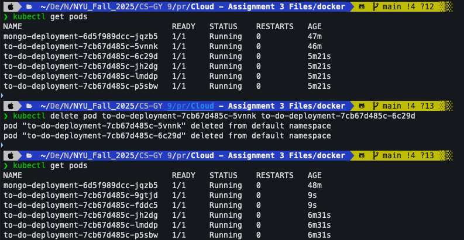


Scale up or down using either 'kubectl scale deployment to-do-deployment --replicas=n' or by editing the yaml file.
we can scale down the replicas without changing yaml file
```
kubectl scale deployment to-do-deployment --replicas=3
```
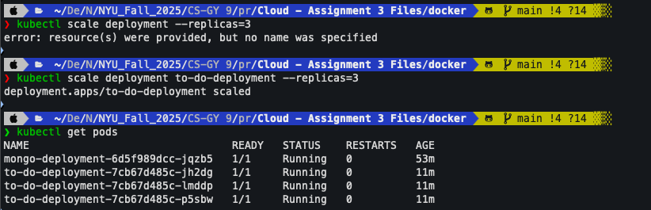

## Rolling Update Strategy;
Configure the Kubernetes deployment to use a rolling strategy. Set the update strategy to rolling Update and specify the maximum number of pods that can be unavailable during the update.
```
# edit the flask-deployment.yaml
  strategy:
    type: RollingUpdate
    rollingUpdate:
      maxUnavailable: 1 
      maxSurge: 1  
```
When update this Deployment, don't delete all old Pod first.
Instead, replace them gradually, one by one, while keeping the service running.
This is the default strategy for Deployments - safer and ensures zero downtimes.

Update the Docker image for hte deployment to a new version.
```
# to show the update we edit the app.py
heading = "ToDo Reminder V2"
docker buildx build -t flask-app .
docker push majiny/flask-app:v2
```
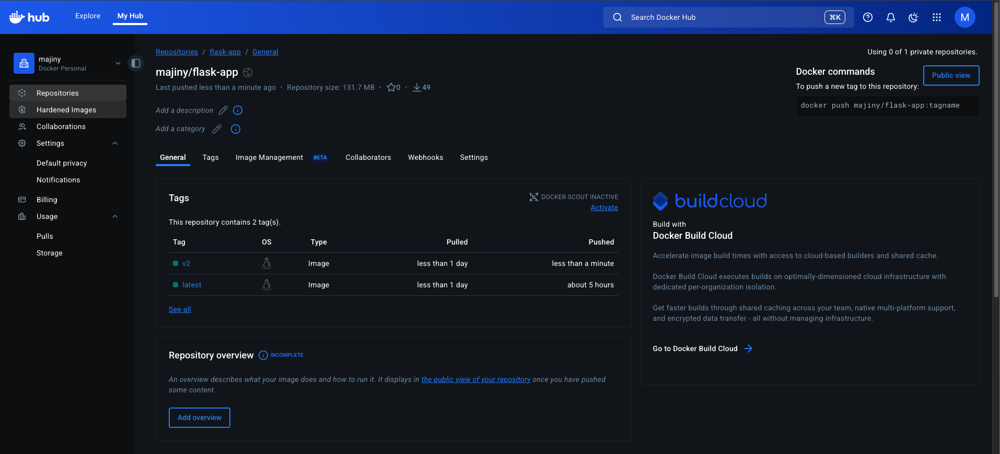

Tigger the rolling update by the deployment with the new Docker imageversion.
```
# change the image version to v2
    spec:
      containers:
        - name: to-do
          image: majiny/flask-app:v2
# apply the update deployment
kubectl apply -f flask-deployment.yaml
```
We can check if the strategy works by:
```
kubectl get deployment to-do-deployment -o yaml | grep -A strategy
```
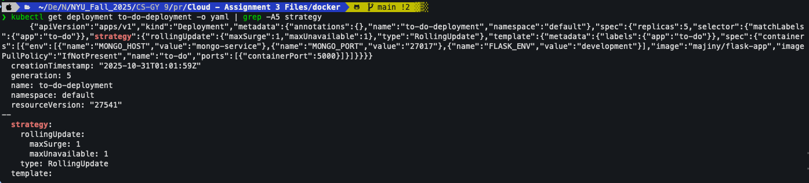


Monitor the rolling update progress using the Kubernetes CLI or Kubernetes Dashboard.
```
# monitoring rollout progress
kubectl rollout status deployment/to-do-deployment
```
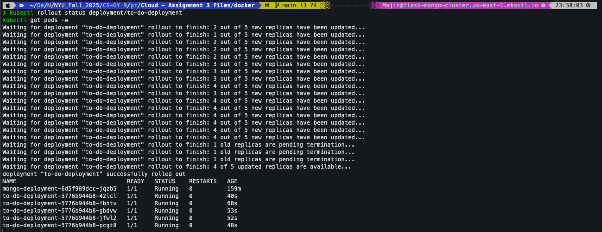
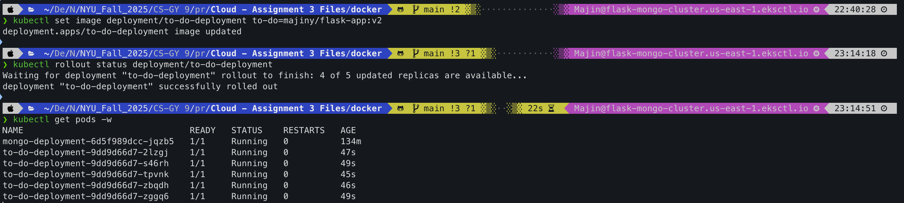

Test the updated application to ensure that it is running with the new Dockerimage version.
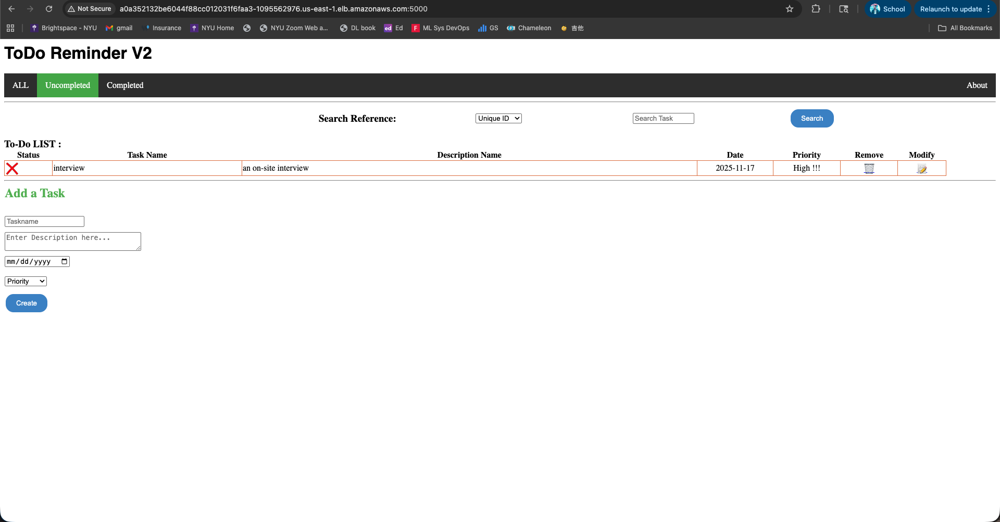
As we can see the we have modify the head to ToDo Reminder V2, which is match to the new verion of website.

## Health monitoring
Configure Kubernetes to monitor the health of the application by setting up probes for the pods. There are two type of probes: liveness Prob and readiness Probe. A liveness Probe checks if the pod is alive and healthy, while a readiness Prob checks if the pod is ready to receive traffic. Specify the probe's configuration by setting parmeters such as the probe type, the probe endpointm the probe interval.
Configure Kubernetes to take action if a probe fails, such as by restarting the pod or making it as unhealthy.
```
# add to app.py
@app.route('/healthz')
def healthz():
    return "OK", 200  # liveness

@app.route('/ready')
def ready():
    try:
        # Ping the MongoDB server
        client.admin.command('ping')
        return "Ready", 200
    except errors.PyMongoError as e:
        # Database is down or not reachable
        return f"Database not ready: {e}", 500

# add to flaks-deployment.yaml
          livenessProbe:
            httpGet:
              path: /healthz
              port: 5000
            initialDelaySeconds: 10 
            periodSeconds: 15    
            failureThreshold: 3      
          
          readinessProbe:
            httpGet:
              path: /ready
              port: 5000
            initialDelaySeconds: 5  
            periodSeconds: 10
            failureThreshold: 3
```
helthz() is the endpoint tells k8s, the flask container process is alive and running.
ready() tells ks that the app and mongodb aarea ready to handle requests.
After 10s startup delay, k8s will check every 15s, and if/healthz fails 3 times in a row, the container is restarted.
The readiness probe tells k8s if the pod is ready to receive traffic. If this probe fails, the pods stays in the cluster but is removed from the Service endpoint list.

Monitor the health of the pods using the Kubernetes CLI or the Kubernetes Dashboards.
Test the health monitoring system by intentionally causing a failure, such as by adding a deliberate error to the application code, and verifying taht kubernetes takes the appropriate actions.

```
@app.route('/healthz')
def healthz():
    return "Unhealthy", 500
```
```
kubectl apply -f flask-deployment.yaml
```
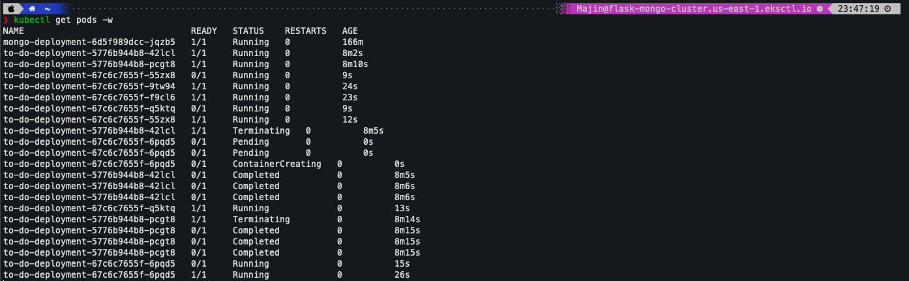